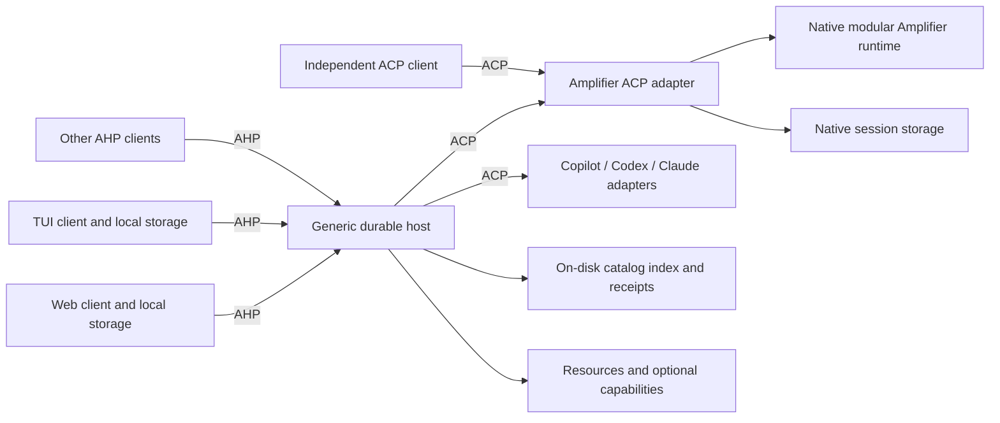

# Amplifier Unified: protocol and ownership redesign

**Design packet, 2026-10-02. Implementation pending.** The product direction is
authorized: adopt AHP/ACP, preserve Amplifier modularity, move private UI state
to clients, bound working sets, and develop across independently owned repos.
The detailed contracts and acceptance budgets below remain DRAFT proposals.
This packet changes documentation; it does not establish protocol conformance.

## Decision

Use **AHP between clients and a durable host**, and **ACP between that host and
agents, including Amplifier**. Put an ACP adapter around the native application
runtime that manages `AmplifierSession`, rather than replacing the kernel or
allowing a permanent native bypass. Use upstream SDKs, schemas and reducers where
available. Prefer standard capabilities before negotiating extensions.

The host is an ACP **client** and an AHP **server**. These protocol roles differ
from the human-facing meaning of client. A direct ACP editor can use the Amplifier
agent without Unified; it does not automatically receive Unified's multi-client
coordination. Two hosts cannot concurrently own the same writable native session.

Bind a conversation to its **agent implementation and native session identity**,
not its originating browser or terminal. An authorized compatible UI can attach
later. Cross-engine continuation is out of scope. Agent replacement is supported
for new conversations; UI replacement is supported within negotiated capabilities.

## Read the packet

| Document | Owns |
| --- | --- |
| [Family vision](VISION.md) | Intended product and architectural destination |
| [Host protocol contract](../../contracts/host-protocol.v1.md) | AHP host and client boundary, upstream authority |
| [Agent protocol contract](../../contracts/agent-protocol.v1.md) | ACP boundary and preservation of native runtime behavior |
| [Working-set contract](../../contracts/working-set.v1.md) | Discovery, residency, history preservation and bounded work |
| [Component contract](../../contracts/component-boundaries.v1.md) | Independently runnable, replaceable parts |
| [Existing client contracts](../clients/direction.md) | Experience, state ownership and coordinated development |
| [State and storage design](state-and-storage.md) | Client caches, catalog, history, memory and recovery |
| [Protocol fit and interoperability](protocol-fit.md) | Standard versus extension, tradeoffs and external candidates |
| [Repository boundaries](repositories.md) | Existing repos to reuse, proposed extractions and dependency direction |
| [Delivery plan](delivery-plan.md) | Parallel lanes, prerequisites, validation, cutover and rollback |
| [Evidence](evidence.md) | Current source findings, limits and upstream revisions |

## Decisions that drive the design

1. Ordinary drafts, unsaved settings edits, selection, expansion, scroll and
   layout are private client state. Typing or expanding a panel causes no backend
   mutation. Shared drafting and targeted agent inspection are explicit features.
2. AHP owns replication semantics. Clients retain resource snapshots and consume
   actions with the upstream reducer/reconciliation model. Missing baselines mean
   resubscribe; reconnect is not permission to replay business commands.
3. Catalog queries are disk-indexed, filtered and paged. Default visibility means
   a confirmed existing workspace directory and a root conversation. Child
   sessions become relevant when a specific conversation requests them.
4. Native transcripts, metadata and retained event logs stay durable. The catalog
   and rendered projections are rebuildable indexes, not new resume authorities.
5. Running work, pending decisions and active ownership are protected. Idle
   runtimes are evictable independently of whether a client can read their history.
   Reading or selecting a historical chat does not initialize its agent.
6. Repository boundaries follow contracts. A repo need not become a network
   service. Small independently versioned packages are useful boundaries too.
7. Amplifier provider, tool, hook, loop, context, bundle and capability modularity
   stays behind the ACP adapter. Plain ACP peers get an honest baseline; advanced
   controls require advertised support and have an explicit unavailable state.
8. Existing sessions are classified for safe native resume or preserved read-only
   access. There is no required wholesale history migration and no replay to
   recreate a session. Unsupported legacy behavior may be retired visibly.

## What adopting protocols does and does not buy

AHP supplies resource subscriptions, state actions, reconciliation and reconnect.
ACP gives the execution seam independent clients and agents can implement.
Together they support separate development and community substitution without
giving each client access to Amplifier internals. This matches the upstream
[AHP/ACP comparison](https://microsoft.github.io/agent-host-protocol/guide/ahp-and-acp.html).

Neither protocol makes our persistence, projections or runtime residency efficient
automatically. Serializing the existing global application state behind a new AHP
endpoint would preserve the bottleneck. Acceptance therefore measures work and
memory per resource as well as payload size and visible latency.

We accept adapter maintenance, explicit version/capability qualification and some
feature differences across peers. We do not promise all Amplifier controls in
every ACP editor, or that vendor consumer apps accept arbitrary AHP hosts. Those
are separate compatibility claims requiring actual tests.

## First milestone

Build one complete path: a web client and a real TUI use AHP to observe and control
one native Amplifier conversation through ACP; a second agent runs through the
same host; an independent ACP client runs our agent. Give each client independent
local drafts. Exercise disconnect, restart, duplicate/unknown delivery and cold
history. Run against the 4,000-project/25,000-session fixture before broad feature
extraction. This is the architecture proof, not a release declaration.

The [delivery plan](delivery-plan.md) makes the work independently runnable using
fixture peers and identifies the later feature, compatibility and deployment gates.
