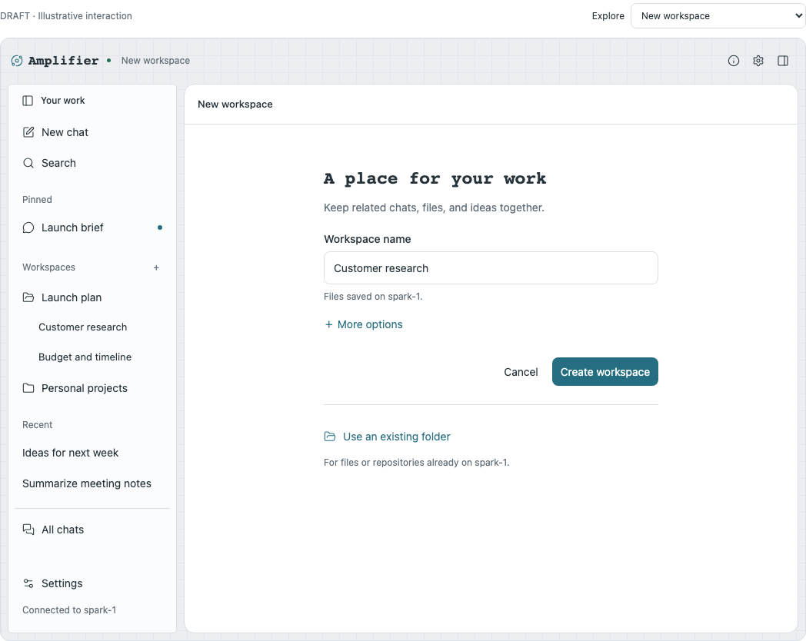
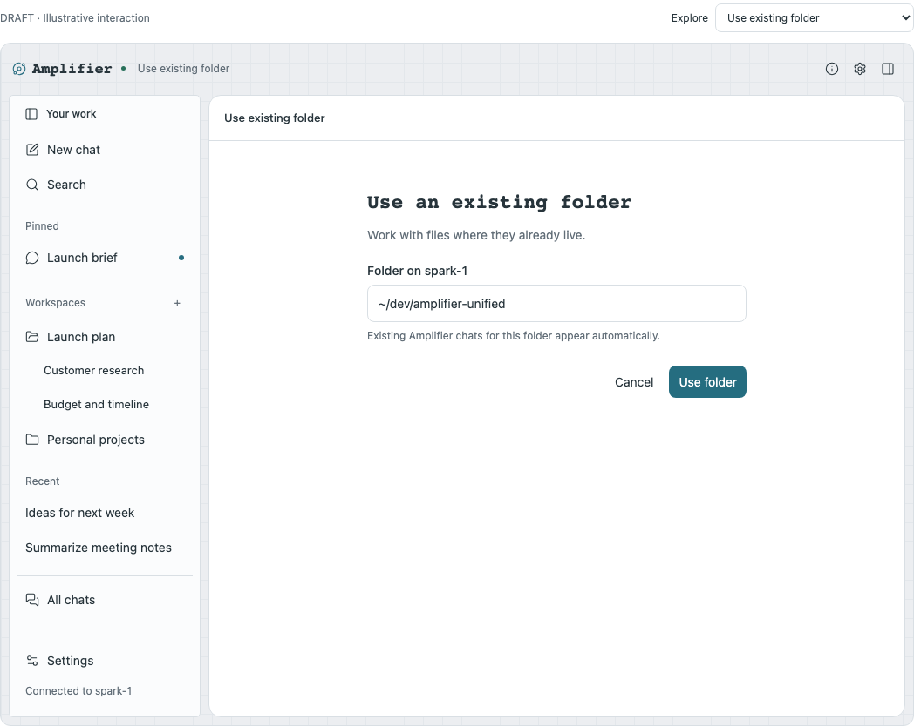
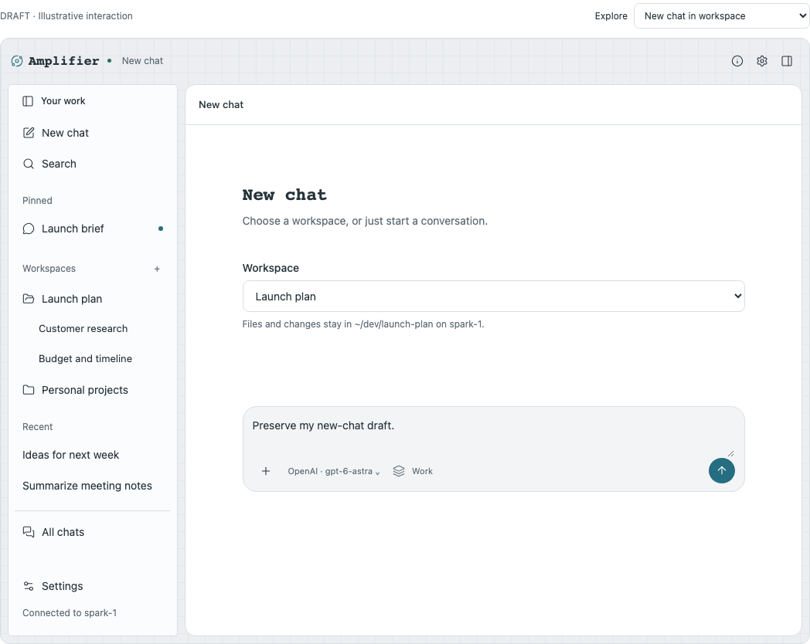
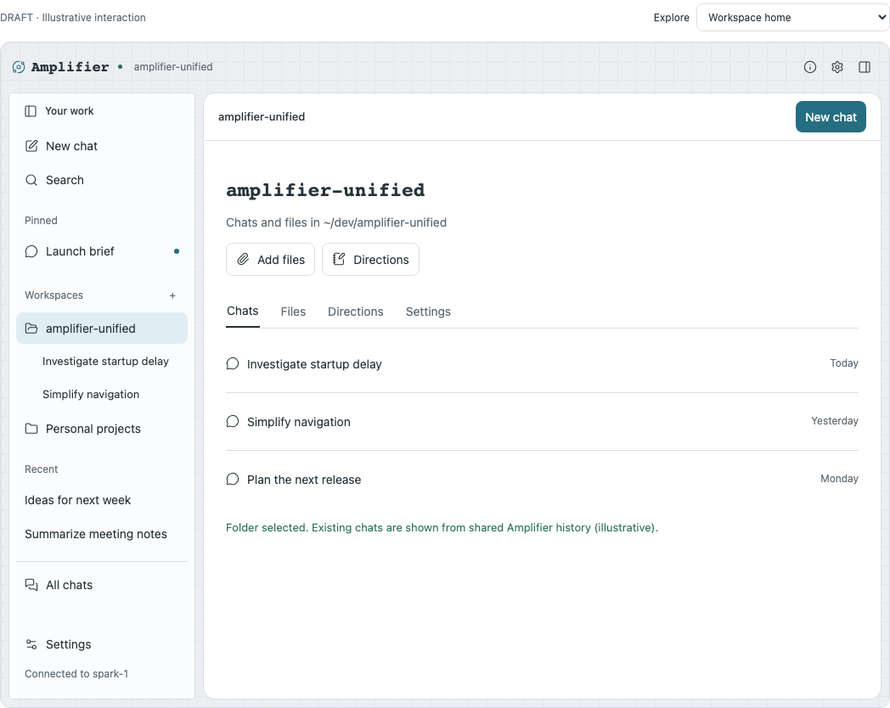
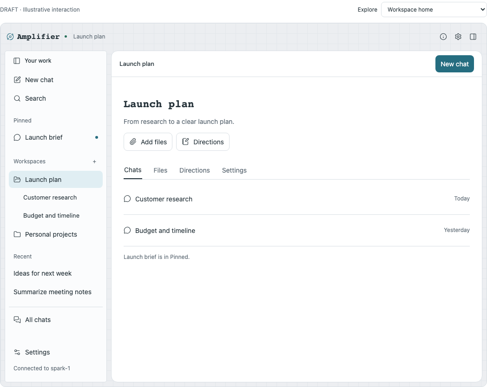
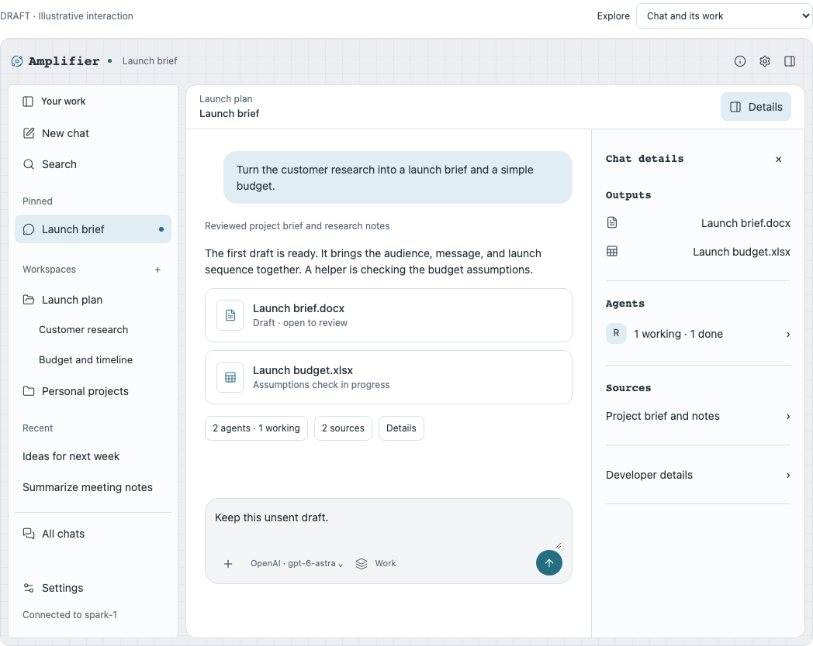
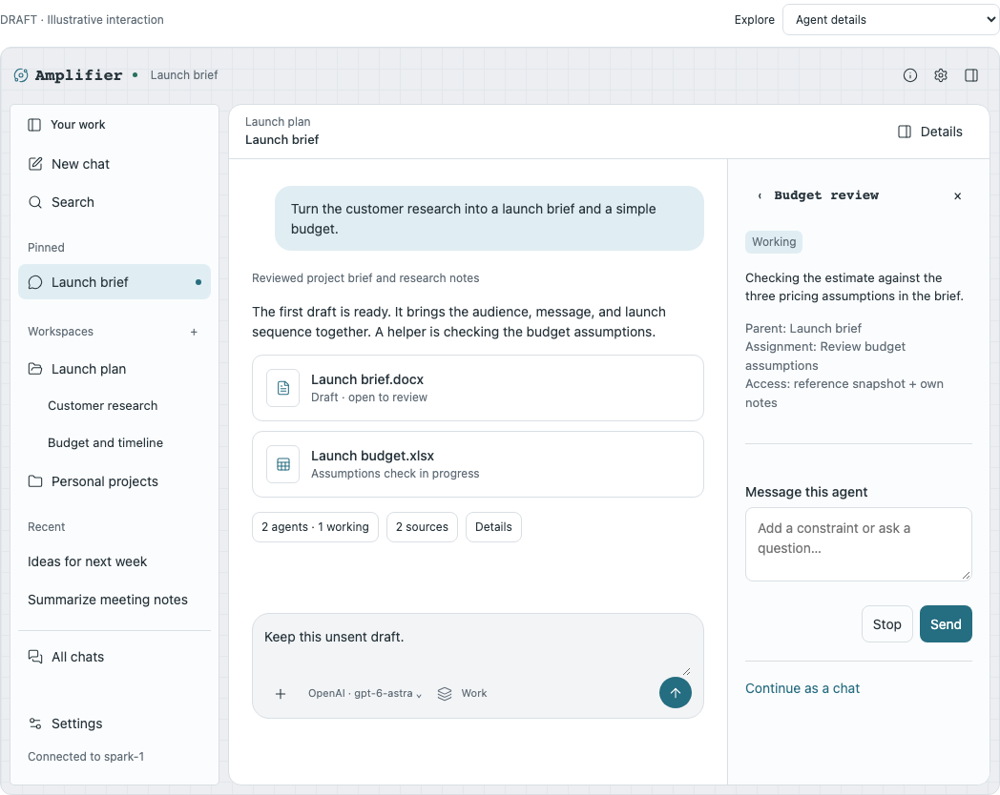
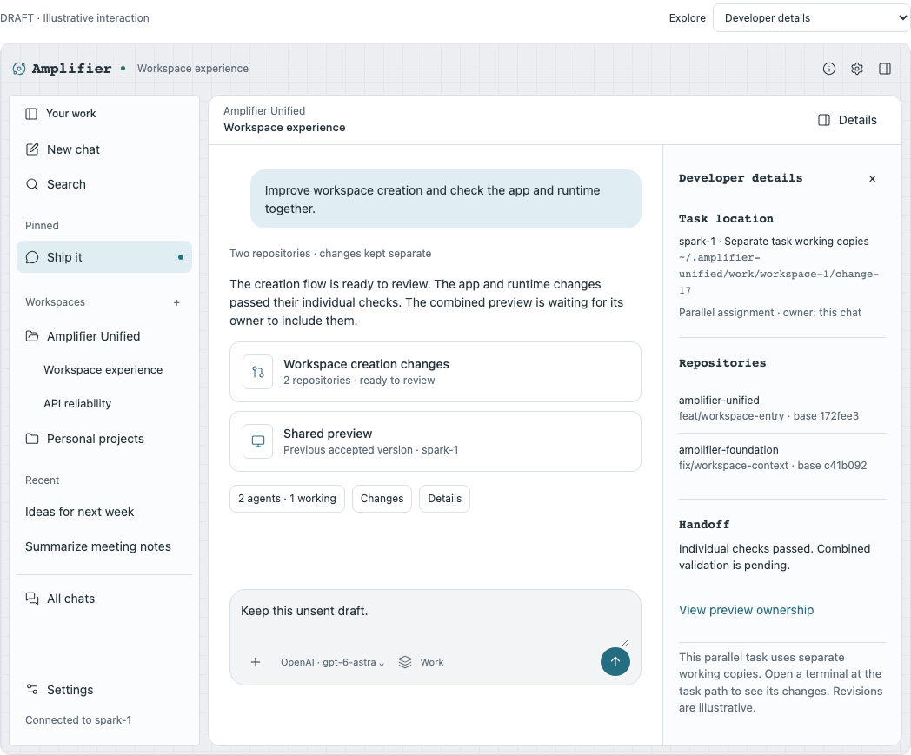
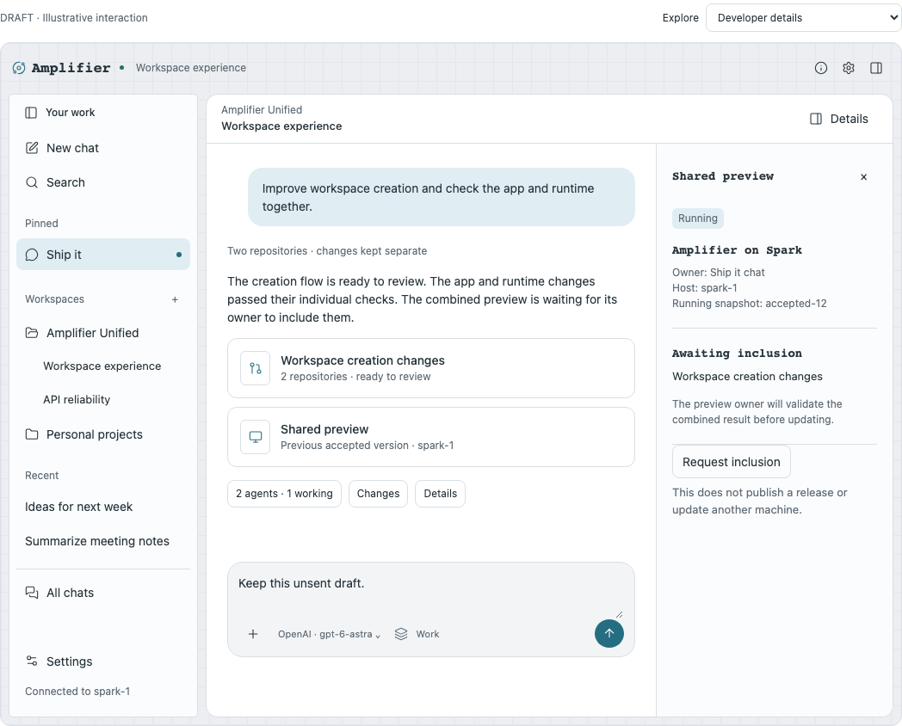

# Workspace experience walkthrough

Design proposal, September 22, 2026. All examples describe proposed behavior. The interactive prototype simulates its actions and uses illustrative content.

## Start with the current Unified app

The running Amplifier PWA on this Mac was inspected at `spark-1:8443/`. Its shell has a subtle grid background, teal accents, monospace headings, a compact Amplifier header, a pinned navigation surface, rounded conversation/composer surfaces, and a resizable right-hand Canvas. The mockups retain those characteristics. The logo is a placeholder; implementation should use the existing Amplifier asset and theme tokens.

The change is to organization and workflow, not a replacement visual language. Keep model, reasoning, bundle, attachment, and voice controls in the existing composer. Preserve the shell's navigation pinning/resizing and Canvas focus behavior. Existing chat naming, export, recovery, and diagnostics actions remain available in the chat overflow menu. They are omitted from the prototype to focus on workspace changes.

Keep chat search visible and put Active/Archived, Sort, Location, and activity filters under **Filters** in each chat list. The September 23 follow-up combines the former simple sidebar and full-library entrance into one view. People should see their work before filtering controls.

Use the existing Canvas region for chat details, outputs, references, and agent reports. It is one right-hand inspection area, with tabs when needed—not another permanent fourth column. Opening details preserves any existing Canvas tabs and selected output. The prototype shows one selected panel at a time; retained multi-tab behavior is an implementation requirement.

## 1. A new workspace starts with a name

Entry: **+** beside Workspaces, or **Create new workspace…** in the New chat workspace picker.

The form asks **Workspace name**, with a small **Files saved on spark-1** line. **Create workspace** creates its directory and registration. From New chat, it returns to the same draft with that workspace selected. From the sidebar, it opens the workspace home. It does not save a blank chat, launch a model, initialize Git, or download a template.

**More options** reveals the parent folder and the exact proposed child path. A location override applies to this creation only. The form need not ask for an agent, repository, bundle, environment, or branch. Use a friendly name such as “Customer research”; derive `customer-research` for the folder, subject to host-specific validation.

The default location is `<app-home>/workspaces`, normally `~/.amplifier-unified/workspaces`. An operator can set `workspaces.defaultRoot` to `~/dev` on Spark. This is the account and filesystem hosting the app, not the Mac viewing its PWA. The first release can show a host label without adding a speculative multi-host picker.

Changing that default affects future workspace allocation only. Changing a workspace's display name does not rename or move its folder. A physical move is a separate future action.



## 2. Existing files have an equally clear entrance

**Use an existing folder** opens a folder picker on the connected host, with a full-path input for developers. A Mac upload is a different control from browsing Spark's filesystem. The prototype implements the path entry; the host folder browser should reuse Unified's existing browser.

Creation resolves three outcomes before changing files:

| Destination | User sees | Result |
|---|---|---|
| No folder exists | Create workspace | Allocate and register the chosen path |
| Folder is already registered | Open workspace | Reuse the existing identity |
| Folder exists but is unregistered | Use existing folder / Choose another name | Attach only after an explicit choice |

Do not silently add “-2”, reinterpret the name as a path, or adopt an empty directory. The same canonical-location check must run again when committing the plan to handle another client racing creation. Existing files, branch state, remotes, submodules, and repository instructions remain untouched during attachment.

The attachment form contains a folder field, the existing host folder browser, Cancel, and Use folder. Remove the redundant folder-summary card and all developer execution options. Selecting the folder means ordinary chat edits happen there, visible to a terminal or editor at the same path. The only explanatory line needed is: “Existing Amplifier chats for this folder appear automatically.” The prototype accepts a typed path; implementation should retain the existing host folder browser.



## 3. Chats remain the easiest starting point

Global **New chat** opens an unsent draft with a **Workspace** picker. Its choices are **No workspace**, existing workspaces, **Create new workspace…**, and **Use an existing folder…**. No workspace remains the default, and choosing another workspace changes the draft's destination before any work starts.

Creating or attaching from this picker returns to that same draft with the workspace selected. Cancel returns to the previous selection. Typed text and attachments survive the detour. A workspace's **New chat** opens the same interface with that workspace preselected.

No workspace uses the existing app-managed file folder. This is file storage, not a separate conversation-history universe: the saved native session still uses the shared Amplifier history service with that folder as its project path.

Existing CLI/TUI chats for an attached folder appear from native history, without an import step. Web, CLI, and TUI expose the same native session IDs. The app can maintain a fast index and presentation metadata, but it must be possible to rebuild chat discovery from native records. The current implementation's app-facing aliases and its required migration are explained in [the native-history note](NATIVE-HISTORY.md).

A saved chat's native project scope remains authoritative. Do not introduce an app-only “Add to workspace” membership list to reassign saved conversations. Display renaming, pins, reference links, and an explicitly supported execution handoff do not relocate saved history. A combined multi-repo view, if provided, must be a projection over explicitly named native project scopes, deduplicated by native SessionRef.






## 4. Keep the sidebar predictable

The default order is **New chat**, then collapsible **Pinned**, **Workspaces**, and **Recent** sections. Recent includes unpinned chats across all available locations, with pages of 40 above 50 matches. Pins have one shared rich-row control; Settings and pins share the full-row drag preview and keyboard reorder. The single workspace explorer includes available empty registrations, path qualifiers, search, and drill-in to all chats in that workspace. Section state and each chat list's filters remain independent. This supersedes the earlier separate All chats entrance.

Workspace rows expand to a short set of recent chats, with **View all** for more. Clicking the workspace name opens its home. Helpers remain under their parent chat, not as automatically generated sidebar rows. Explicitly continuing a helper as an independent chat preserves its history and parent reference.

Names lead. Show a host/path qualifier when two names would be ambiguous; full paths are always available in details and optionally on all rows. Missing folders disappear from the available-workspace list, while saved chats and recovery records remain accessible. Search can find an unavailable workspace and explain its status.

A workspace home offers **Chats**, **Files**, **Directions**, and **Settings**. “Directions” means the user-facing instructions for this workspace. Repositories belong under Settings until relevant code work makes them useful. Documents and research work require zero Git setup.



## 5. Inspect work beside the conversation

An output card opens its file. A small **2 agents · 1 working** action opens agent activity. Chat details collect **Outputs**, **Sources**, and **Agents**; code work also exposes **Changes** and **Preview**. Empty sections disappear. This extends the current Chat details and Subagent history surfaces into the existing Canvas area.

Agent details show the assignment, parent, status, accessible result, and relevant scope. Users can add a constraint, request a stop, or continue as an independent chat when supported and authorized. “Stop requested” remains different from “Stopped”; it does not promise rollback. Completed helpers show their report and validation limits.

Reading a source or agent report is passive. **Use in conversation** explicitly attaches it to the unsent draft. Nothing is silently sent, and switching panels does not change the draft or the ongoing execution binding.

On narrow screens, the details view occupies the content area and provides a return action. Returning restores the same conversation, draft, and focus. The prototype covers responsive layout; complete focus management and screen-reader acceptance remain product work.





## 6. Make concurrent work safe beneath the simple interface

The selected workspace is a real working folder. Ordinary edits happen there. A terminal, editor, Web session, or TUI session at that path sees the same files. There is no attachment-time “direct versus isolated” decision.

That does not make simultaneous writes to the same file safe. Coordinate managed writers: when another chat or helper already owns a conflicting write target, queue the new write or show a concrete busy state. Do not silently move a chat elsewhere. The ownership service cannot pretend to prevent an external editor from writing; observe changes and revalidate before applying results.

For an explicitly requested independent task or authorized parallel delegation, allocate a separate task working area when needed. Its task details show the actual path; “Open terminal” opens there. Changes become visible in the main workspace when the integration owner includes them. This choice belongs to the work being performed, not to the act of selecting a folder.

For those separate tasks, use one managed Git store per repository and authorized host/account scope, with linked worktrees. Existing user clones can be registered as borrowed sources. A managed store needs independent ownership and cannot depend on a borrowed folder surviving. Do not share caches across authorization scopes merely because remote URLs match.

Suggested arrangement for a workspace with an authorized parallel task, deliberately not a public path contract:

```text
~/dev/example/                           # normal workspace and terminal edits
~/.amplifier/projects/<path-slug>/
  sessions/<native-session-id>/          # shared Web/CLI/TUI history
~/.amplifier-unified/
  repositories/<scope>/<repo-id>.git/    # optional owned Git store
  work/<workspace-id>/<task-id>/         # optional separate task files
    app/                                # linked worktree
    runtime/                            # linked worktree
```

Keep temporary task areas outside borrowed source repositories. The workspace-root preference controls new user-visible workspace homes, not history or cache placement. Task working directories do not change the conversation's native history home. Task IDs, resource IDs, and receipt IDs are allowed; they are not replacement conversation IDs.

For documents, produce output drafts in the chosen folder and use version-checked replacement for shared originals. Dependencies, environments, ports, and external resources can also conflict. Record their actual bindings for separate tasks and previews. A worktree protects independent working files; it is not a sandbox for arbitrary shell programs.


## 7. Keep the Spark inner loop fast and accountable

For an authorized parallel Ship it workflow, the parent chat owns an integration change set and a preview target on Spark. Its independent writing helpers receive separate task working areas and work independently and hand back identified snapshots, checks, and unresolved issues. The parent includes selected results, validates the combination, and updates the preview under its existing authority. The user's browser sees the accepted integrated version.

A second top-level chat can prepare another change without writing into that preview checkout or installing its dependency versions into the running app's environment. It requests inclusion from the preview owner through an authorized coordination action. Until included, its status says **Ready to review**, not **Live**.

Multi-repo changes retain exact revision sets and dependency bindings. Tests of each repo do not substitute for checks of the combination. Partial publication remains partial. Preview updates and production releases are different permissions. A restart or lost acknowledgment does not justify repeating external actions blindly.





## What to borrow from amplifier-workspace

Borrow explicit workspace context, layered per-repo instructions, bounded task notes, inspectable resource ownership, and cleanup evidence. Generate runtime context from authoritative records; preserve existing AGENTS.md files and let explicit user directions take priority.

Do not require a disposable root Git repository, a submodule for every repo, or a separate clone of every repo for every chat. Do not delete durable chat history when reclaiming worktrees. Keep resource lifecycle state in the existing services, with an inspectable projection if useful; an editable manifest is not a locking system.

## Implementation order

1. **Placement and native history:** name-first creation, host default root, simple attachment, New chat workspace picker, automatic CLI/TUI discovery, native-ID resolution with legacy aliases, and a simpler sidebar/full-library entrance. Preserve selected-folder execution and all saved history.
2. **Context and details:** workspace references/directions, passive output inspection, agent drill-down, retained Canvas tabs, UI/agent action parity.
3. **Concurrent task execution:** writer queuing/fencing, optional worktrees for authorized independent tasks, dependency/environment binding, recovery, and resource accounting. Test terminal-visible paths and native-history continuity before enabling this behavior.
4. **Integration and preview:** result inclusion, combined validation, accountable preview updates, explicit partial/unknown states, eligible-resource cleanup.

Each slice is useful on its own. Folder attachment never implies isolation. Separate task work must identify its actual location and cannot claim to have updated the main workspace before inclusion. Cross-host portability and unrelated TUI implementation remain owned by their existing workstreams.

## Revision after UX review

The folder-summary card was an unnecessary confirmation, not a sidebar preview. It is removed. Attachment-time developer options are removed. Global New chat now includes workspace selection and creation, and a sixth contract explicitly makes shared native history authoritative. These replace the first draft's automatic-isolation default and app-membership assumptions.
